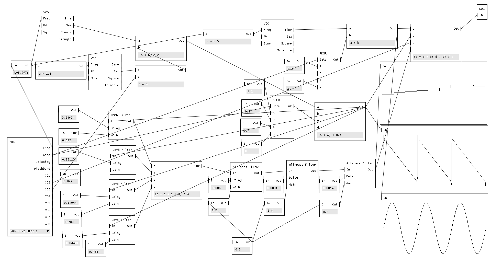

# Sirena

Proof of concept. By no means is this a proper DSP code.

<p align="center">
  
</p>

Run it:

``` sh
cargo run --release
```

Run it with Jack:

``` sh
cargo run --release --features jack
```
