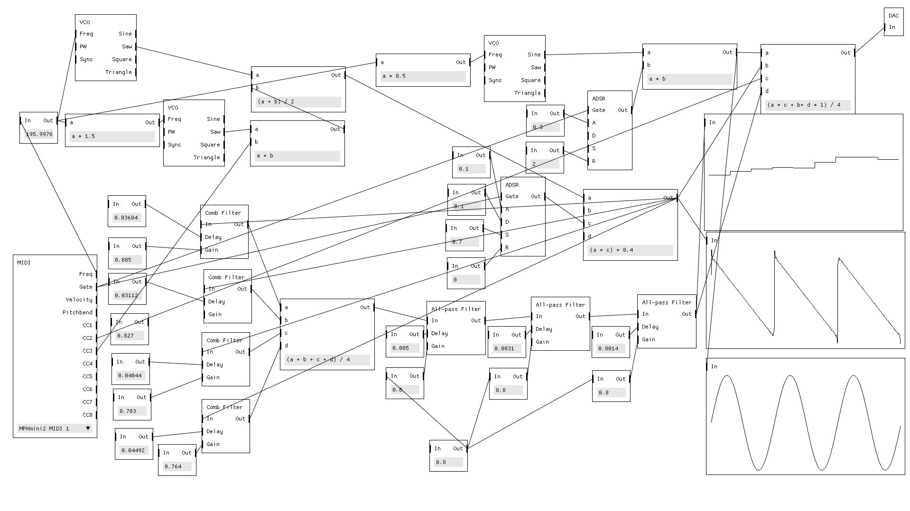

# Sirena UI

DSP framework visualizing and modeling flow between individual signal
generators, functions and consumers registered into the system.

This project partially follows the concept of Pure Data and Max/MSP, but unlike
them, it is not meant to be a full-blown programming language but rather a
visualization tool, putting more responsibility on each module.

<p align="center">
  
</p>

Development of this tool is currently frozen in favor of Pure Data externals
that are kept under this project.

Note that this is just a proof of concept. By no means is this a proper DSP
code.

Run it:

``` sh
cargo run --release
```

Run it with Jack:

``` sh
cargo run --release --features jack
```
